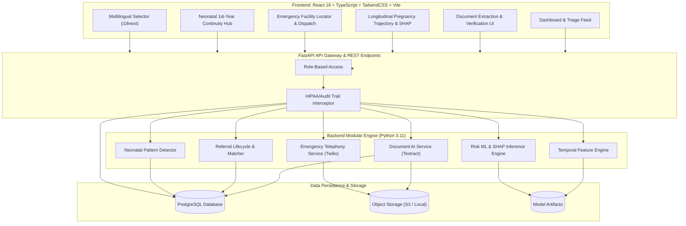
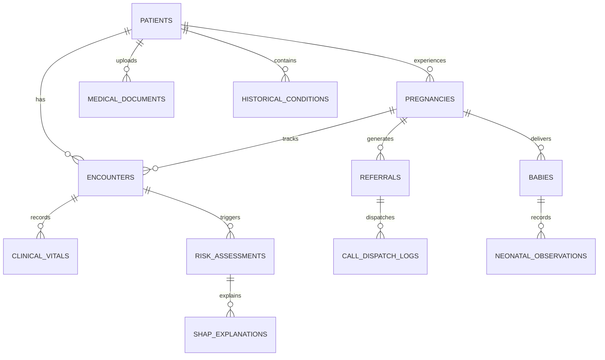
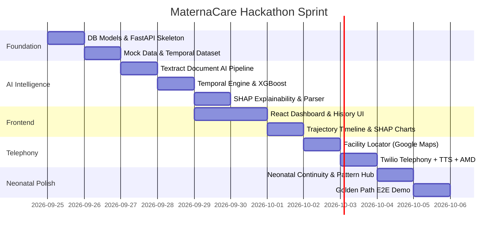

# MaternaCare — Comprehensive Implementation Plan & Engineering Blueprint

---

## 📊 Executive Rating & Feasibility Scorecard

### **Overall Rating: 9.3 / 10**

| Dimension | Rating | Analysis & Rationale |
| :--- | :---: | :--- |
| **Problem-Solution Alignment (HT-06)** | **9.8 / 10** | Directly addresses maternal-neonatal continuity, early warning triage, explainability, and the broken referral chain with human-in-the-loop validation. |
| **Technical Defensibility & Depth** | **9.4 / 10** | Combines Temporal ML (trajectory vs snapshot), Document AI (OCR + verification loop), SHAP explainability, Telephony API + AMD, and Geospatial routing. |
| **Hackathon Demo Impact & Storytelling** | **9.7 / 10** | High dramatic value in live demo: from uploading messy paper history -> interactive SHAP risk trajectory spike -> 1-click facility route -> automated emergency audio call -> baby continuity timeline. |
| **Architectural Feasibility** | **9.0 / 10** | Clean micro-modular monolith (FastAPI + React + PostgreSQL + scikit-learn/XGBoost) makes local execution frictionless while easily containerizing for AWS ECS/RDS. |
| **Execution Risk / Complexity** | **8.6 / 10** | Multi-service dependencies (Twilio, Textract, Maps API) can introduce live demo failure points if resilient mock/live hybrid adapters are not implemented upfront. |

---

## 🏗️ 1. Target Architecture Overview

---

## 🗄️ 2. Core Relational Data Models

The database models are designed to enforce data integrity, full clinical auditability, and temporal tracking:

### Table Specifications:

1. **`patients`**: patient_code, age, blood group, parity, gravidity, primary language.
2. **`medical_documents`**: S3 URI, file hash, extraction status (PENDING, EXTRACTED, VERIFIED, REJECTED), raw OCR payload, extracted JSON schema.
3. **`historical_conditions`**: Category (PREV_PREGNANCY, COMPLICATION, CHRONIC_DISEASE, SURGERY), verified state, verification timestamp.
4. **`encounters` / `visits`**: Gestational age (weeks/days), visit date, facility ID, clinician notes.
5. **`clinical_vitals_labs`**: SBP, DBP, MAP, Heart Rate, SpO2, Fetal Heart Rate, Blood Glucose, Urine Protein (+/++/+++), Hemoglobin, reported symptoms.
6. **`risk_assessments`**: Model version, calculated risk score (0.00-1.00), risk tier (LOW, MODERATE, URGENT_REVIEW, CRITICAL), trajectory direction, inference timestamp.
7. **`shap_explanations`**: Feature names, feature values, SHAP impact values.
8. **`referrals`**: Sending facility, target receiving facility, clinical urgency reason, transfer status (DRAFT, DISPATCHED, ACKNOWLEDGED, ADMITTED).
9. **`call_dispatch_logs`**: Twilio SID, emergency speech audio text, answering party (HUMAN, MACHINE), recording URL.
10. **`babies` & `neonatal_observations`**: Birth weight, APGAR score, post-natal visit week (W1, W6, M3, M6, M9, M12), weight velocity, feeding status.

---

## 🧠 3. Temporal ML & Explainability Pipeline

### 3.1 Feature Engineering (Preventing Data Leakage)
Unlike standard tabular models, MaternaCare uses **point-in-time temporal windows**:

* **Baseline Deltas**: Δ SBP = SBP(current) - SBP(baseline)
* **Velocity / Rate of Change**: Δ MAP / Δ GestationalWeeks
* **Longitudinal Trend Vector**: Rolling standard deviation of vitals over last 3 visits.
* **Compound Clinical Flags**:
  * Preeclampsia cluster: (SBP >= 140 OR DBP >= 90) + Proteinuria + Visual Disturbances.
  * Gestational Infection cluster: Temp >= 38.0°C + Tachycardia + FHR >= 160.
* **Historical Interaction Multiplier**: Weight given to previous C-section, history of preeclampsia, or previous neonatal loss.

### 3.2 Model Training & Explainability Engine
* **Algorithms**: Calibrated XGBoost Classifier (tuned for low False Negatives) + Random Forest baseline.
* **SHAP TreeExplainer**: Generates local SHAP values per prediction in < 20ms.
* **Clinical Plain-Language Translation**: Automatically translates SHAP contributions into clinical bullet points (e.g., *"SBP spiked +24 mmHg in 2 weeks while gestational age is 34w (contributes +38% to Urgent Review category)"*).

---

## ⚡ 4. Phase-by-Phase Execution Roadmap

### Phase 1: Core Foundation & High-Fidelity Data Pipeline
* Setup FastAPI backend structure with modular routing.
* Configure SQLAlchemy / Alembic migrations with SQLite (local zero-config) and PostgreSQL (AWS RDS).
* Load authorized maternal clinical dataset and setup temporal chronological validation splits.

### Phase 2: Document AI & Extraction-Verification Loop
* Build Amazon Textract integration with fallback OCR processor.
* Implement LLM/Rule-based Clinical Entity Extractor mapping raw text into JSON.
* Create **Human-in-the-Loop Verification API**: front-line worker confirms, modifies, or rejects extracted entities.

### Phase 3: Temporal Risk Engine & Explainability API
* Implement `TemporalFeatureEngine` computing rolling statistics, rates of change, and historical interactions.
* Train, calibrate, and serialize the XGBoost risk model using MLflow.
* Integrate `shap.TreeExplainer` producing JSON response containing risk contributors.

### Phase 4: Responsive Frontend (React + TypeScript + TailwindCSS)
* Setup modern UI with Vite, TailwindCSS, Lucide icons, and Recharts.
* **Component 1: Triage Dashboard**: Patient risk cards with color-coded badges.
* **Component 2: Patient Health Memory**: Side-by-side OCR viewer + extraction checklist.
* **Component 3: Pregnancy Timeline**: Interactive trend charts showing vitals with SHAP breakdown drawer.
* **Component 4: Multilingual Support**: Instant switcher between English, Spanish, and French.

### Phase 5: Facility Routing & Emergency Voice Dispatch
* **Google Maps Integration**: Nearby hospital discovery based on GPS coordinates.
* **Twilio Emergency Voice API**: Synthesizes clinical summary into concise emergency script with Answering Machine Detection (AMD).

### Phase 6: Maternal -> Neonatal Continuity
* Baby birth registration linked seamlessly to mother's profile.
* **Pattern-Change Detection Algorithm**: Flags significant percentile drops in weight velocity or feeding deviations.

### Phase 7: Demo Readiness
* Dockerize backend and frontend with `docker-compose.yml`.
* Prepare complete automated seed script running the exact "Judge Demo Story".

---

## 🛡️ 5. Resilient Architecture & Fallback Mechanisms (Pitch-Proof Design)

To ensure **0% failure rate during live hackathon demos**, every external service has a dual-mode adapter:

| Service | Live Mode | Offline/Fallback Mode (Activated via Config) |
| :--- | :--- | :--- |
| **Document OCR** | AWS Textract API | High-accuracy pre-processed clinical document cache |
| **Maps & Routing** | Google Maps API | Local Geo-distance calculator with pre-seeded facility registry |
| **Emergency Calling** | Twilio REST Voice API | Browser Synthesizer + Interactive In-App Dispatch Audio Visualizer |
| **Database** | AWS RDS PostgreSQL | Local SQLite database auto-migrating with zero setup |

---

## 🎯 6. The Golden Demo Script (Step-by-Step 4-Minute Presentation)

1. **Minute 0:00 – 0:45 | The Fragmented History Problem**
   * Upload an unstructured discharge summary.
   * Show AI extraction: system detects *prior preeclampsia* and *penicillin allergy*. Clinician clicks **"Verify & Commit"**.
2. **Minute 0:45 – 1:45 | Temporal Spike & SHAP Explainability**
   * Record current visit vitals.
   * Notice the risk indicator change: Snapshot BP alone is borderline, but **Temporal Trajectory** flags a steep +22 mmHg jump.
   * Open SHAP waterfall: show exact contribution of rapid MAP increase and historical context.
3. **Minute 1:45 – 2:45 | Emergency Referral & Live Telephony Dispatch**
   * Click **"Initiate Emergency Referral"**. Google Maps locates nearest hospital.
   * Click **"Dispatch Emergency Call"**: Twilio initiates call / audio player reads structured voice alert. Status transitions to `ACKNOWLEDGED`.
4. **Minute 2:45 – 3:30 | Maternal -> Neonatal Continuity**
   * Transition to Post-Delivery: Open baby profile.
   * Month-1 visit records a weight velocity drop; system flags **Pattern Change Alert** for pediatric review.
5. **Minute 3:30 – 4:00 | Summary & Impact**
   * Conclude: **REMEMBER -> UNDERSTAND -> PREDICT -> EXPLAIN -> REFER -> FOLLOW UP**.
