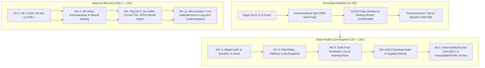
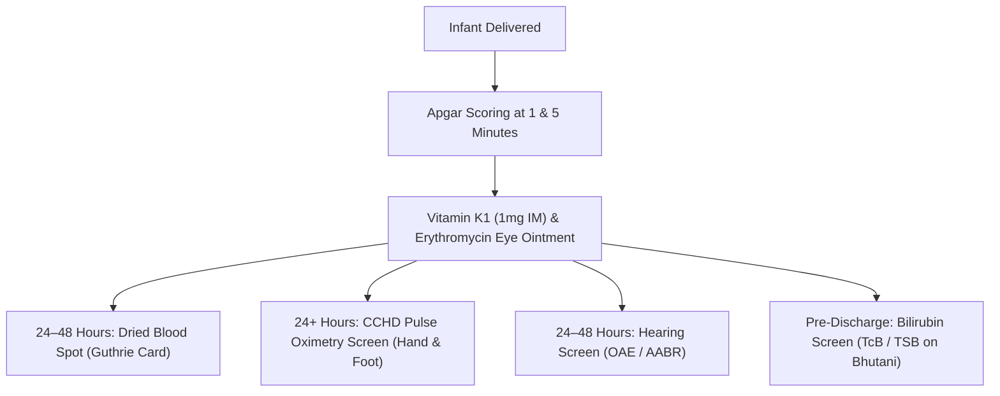
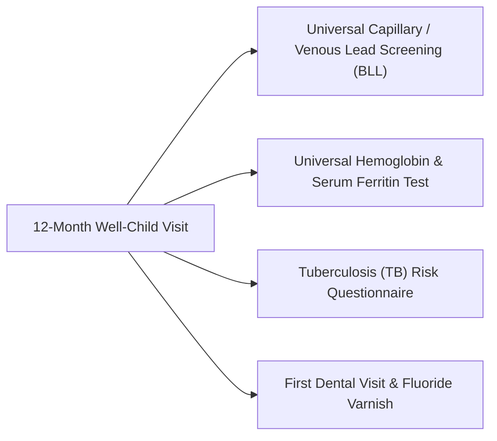
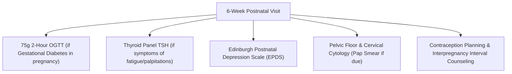

# 👶 Complete Postpartum & Infant Diagnostic Care Protocol (Birth to 1 Year)
### *Evidence-Based Clinical Guidelines for Mother, Infant & Parents (AAP, ACOG, WHO, CDC & NHS Standards)*

---

## 📑 Table of Contents
1. [Executive Summary & Timeline Architecture](#1-executive-summary--timeline-architecture)
2. [Master Postpartum Timeline (Birth to 12 Months)](#2-master-postpartum-timeline-birth-to-12-months)
3. [Infant Clinical Diagnostics & Screening Protocol (Birth to 1 Year)](#3-infant-clinical-diagnostics--screening-protocol-birth-to-1-year)
   - [3.1 Immediate Newborn Evaluations (0 – 72 Hours)](#31-immediate-newborn-evaluations-0--72-hours)
   - [3.2 1 to 2 Weeks Well-Child Diagnostics](#32-1-to-2-weeks-well-child-diagnostics)
   - [3.3 1 to 2 Months Checkup & Screenings](#33-1-to-2-months-checkup--screenings)
   - [3.4 4 to 6 Months Metabolic & Developmental Screenings](#34-4-to-6-months-metabolic--developmental-screenings)
   - [3.5 9 Months Developmental & Anemia Evaluation](#35-9-months-developmental--anemia-evaluation)
   - [3.6 12 Months Universal Diagnostic Labs (Lead, Hb, Oral Health)](#36-12-months-universal-diagnostic-labs-lead-hb-oral-health)
4. [Maternal Postpartum Diagnostic & Recovery Protocol](#4-maternal-postpartum-diagnostic--recovery-protocol)
   - [4.1 Inpatient / Immediate Postpartum (0 – 48 Hours)](#41-inpatient--immediate-postpartum-0--48-hours)
   - [4.2 Early Recovery & Hypertensive Surveillance (Week 1 – 2)](#42-early-recovery--hypertensive-surveillance-week-1--2)
   - [4.3 Comprehensive 6-Week Postnatal Medical Checkup](#43-comprehensive-6-week-postnatal-medical-checkup)
   - [4.4 Long-Term Maternal Health (3, 6, 9 & 12 Months)](#44-long-term-maternal-health-3-6-9--12-months)
5. [Paternal & Family Wellness Diagnostics](#5-paternal--family-wellness-diagnostics)
6. [Universal Newborn Blood Spot (Guthrie) Diseases Screened](#6-universal-newborn-blood-spot-guthrie-diseases-screened)
7. [Pediatric & Maternal Critical Warning Thresholds Matrix](#7-pediatric--maternal-critical-warning-thresholds-matrix)

---

## 1. Executive Summary & Timeline Architecture

The fourth trimester (first 12 weeks post-birth) through the infant's first birthday represents a critical window of physiological adaptation, rapid neurological development, and maternal recovery.



---

## 2. Master Postpartum Timeline (Birth to 12 Months)

| Timeframe | Subject | Diagnostic Test / Clinical Assessment | Modality / Tool | Clinical Indication / Rationale |
| :--- | :--- | :--- | :--- | :--- |
| **0 – 10 Minutes** | **Infant** | **Apgar Score (1 min & 5 min)** | Physical Exam | Evaluates immediate extrauterine transition (Heart Rate, Respiratory effort, Muscle tone, Reflex irritability, Color). |
| **0 – 2 Hours** | **Mother** | **Immediate Postpartum Hemorrhage Surveillance** | Vitals & Physical | Fundal height & uterine contractility assessment; Vitals q15m; Lochia flow monitoring. |
| **24 – 48 Hours** | **Infant** | **Universal Newborn Screening (NBS / Guthrie Test)** | Dried Blood Spot (Heel Prick) | Screens for 50+ Inborn Errors of Metabolism (PKU, Galactosemia, MSUD), Congenital Hypothyroidism, CAH, SCID, SMA, Sickle Cell. |
| **$\ge$ 24 Hours** | **Infant** | **Critical Congenital Heart Disease (CCHD) Screen** | Pulse Oximetry ($SpO_2$) | Pre-ductal (right hand) vs. post-ductal (either foot) oxygen saturation comparison. |
| **24 – 48 Hours** | **Infant** | **Universal Newborn Hearing Screen (UNHS)** | OAE or AABR | Automated Auditory Brainstem Response or Otoacoustic Emissions to screen sensorineural deafness. |
| **24 – 48 Hours** | **Infant** | **Total Serum Bilirubin (TSB) / Transcutaneous (TcB)** | Photometry / Blood | Plotted on Bhutani Nomogram to detect neonatal hyperbilirubinemia & prevent Kernicterus. |
| **24 – 48 Hours** | **Mother** | **Post-Delivery CBC & Blood Type Antibody Verification** | Blood Test | Hemoglobin/Hematocrit check for blood loss; Cord blood Rh(D) check: administer Anti-D within 72h if infant is Rh+. |
| **Days 3 – 5** | **Infant** | **Early Weight Nadir & Bilirubin Re-evaluation** | Scale & Clinical/TcB | Physiological weight loss evaluation (normal $< 7-10\%$); Follow-up on physiologic jaundice. |
| **Week 1 – 2** | **Mother** | **Postpartum Blood Pressure & Wound Check** | Sphygmomanometer & Exam | Screens for delayed postpartum preeclampsia/eclampsia; Inspects C-section Pfannenstiel or perineal repair. |
| **Week 2** | **Infant** | **2-Week Well-Child Checkup** | Physical & Biometry | Weight regain to birth weight check, Umbilical cord stump check, Feeding/Lactation adequacy. |
| **Month 1** | **Infant** | **1-Month Health & Vision Reflex Evaluation** | Red Reflex (Brückner) | Ophthalmoscopy for red reflex (screens Retinoblastoma, Congenital Cataract); Primitive reflexes check. |
| **Month 1 – 2** | **Both Parents**| **Edinburgh Postnatal Depression Scale (EPDS)** | Standardized Survey | Screens Maternal & Paternal Postpartum Depression and perinatal anxiety disorders. |
| **Month 2** | **Infant** | **Developmental & Hip Dysplasia Screening** | Barlow & Ortolani Maneuvers | Assesses Developmental Dysplasia of the Hip (DDH); Ultrasound of hips if breech presentation at birth. |
| **Week 6** | **Mother** | **Comprehensive 6-Week Postnatal Exam** | Blood / Exam / Survey | **75g 2-hr OGTT** (for GDM mothers), TSH (postpartum thyroiditis), Pelvic floor evaluation, EPDS survey. |
| **Month 4** | **Infant** | **4-Month Milestones & Growth Velocity** | WHO Growth Chart | Evaluates head control, visual tracking ($180^\circ$), social smile, vocalization, rolling. |
| **Month 6** | **Infant** | **6-Month Metabolic & Primary Dentition Assessment** | Physical / Oral Exam | Introduction of complementary feeding; Iron status assessment; First teeth emergence examination. |
| **Month 9** | **Infant** | **Developmental Screening (ASQ-3 / SWYC)** | Validated Assessment Tool | Standardized developmental surveillance (gross motor, fine motor, communication, problem solving). |
| **Month 9** | **Infant** | **Targeted Iron Deficiency Anemia Screen** | Fingerstick / CBC | Indicated in preterm, low birth weight, or unsupplemented breastfed infants. |
| **Month 12** | **Infant** | **Universal Blood Lead Level (BLL) Screening** | Capillary / Venous Blood | Universal Lead Screening (CDC reference: $< 3.5\ \mu\text{g/dL}$); Identifies environmental toxic exposure. |
| **Month 12** | **Infant** | **Universal Hemoglobin & Anemia Blood Test** | CBC / Ferritin | Detects nutritional iron-deficiency anemia ($\text{Hb} \ge 11.0\text{ g/dL}$ target); Oral fluoride varnish application. |
| **Month 12** | **Mother** | **1-Year Cardiometabolic & Wellness Review** | Blood Panel / Exam | Lipid profile, Fasting glucose, BP, Cervical cytology (Pap smear if due), Micronutrient replenishment check. |

---

## 3. Infant Clinical Diagnostics & Screening Protocol (Birth to 1 Year)

### 3.1 Immediate Newborn Evaluations (0 – 72 Hours)



1. **Apgar Score (1 Minute & 5 Minutes Post-Delivery):**
   - Evaluates:
     - **A**ppearance (Skin color / Cyanosis vs. Pink)
     - **P**ulse (Heart rate: $< 100$ vs. $> 100\text{ bpm}$)
     - **G**rimace (Reflex irritability to stimulation)
     - **A**ctivity (Muscle tone / flexion of extremities)
     - **R**espiration (Vigorous cry vs. slow/irregular/absent)
   - *Score Interpretation:* 7–10 = Normal / Reassuring; 4–6 = Moderate depression (airway clearance, tactile stimulation, $O_2$ support); 0–3 = Severe depression (immediate neonatal resuscitation / Bag-Valve-Mask ventilation).
2. **Universal Newborn Blood Spot Screening (NBS / Guthrie Test):**
   - *Timing:* Collected between **24 and 48 hours of life**, ideally after the infant has received protein feedings (breast milk or formula) for $\ge 24\text{ hours}$.
   - *Method:* Heel-prick capillary blood applied to 5 circles on approved filter paper (Whatman 903).
   - *Target Screened Conditions:* Over 50 rare genetic, endocrine, and metabolic disorders (detailed in Section 6).
3. **Critical Congenital Heart Disease (CCHD) Screening:**
   - *Timing:* At $\ge 24\text{ hours}$ of age (or prior to discharge if $< 24\text{h}$).
   - *Method:* Pulse oximeter placed on **Right Hand** (pre-ductal) and **Either Foot** (post-ductal).
   - *Passing Criteria:*
     - $SpO_2 \ge 95\%$ in both right hand and foot **AND**
     - Difference between right hand and foot $\le 3\%$.
   - *Failing / Repeat Protocol:* If $SpO_2$ is $90-94\%$ or difference $> 3\%$, repeat twice at 1-hour intervals. If still failing or any reading $< 90\%$, immediate pediatric echocardiogram is mandated.
4. **Universal Newborn Hearing Screening (UNHS):**
   - **Otoacoustic Emissions (OAE):** Measures acoustic echo generated by outer hair cells in response to clicks.
   - **Automated Auditory Brainstem Response (AABR):** Measures electrophysiologic neural activity along the auditory nerve to the brainstem.
   - *Result:* "Pass" or "Refer". Any "Refer" requires diagnostic audiologic evaluation by 3 months of age.
5. **Hyperbilirubinemia Screening & Bhutani Nomogram Plotting:**
   - Universal Transcutaneous Bilirubin (TcB) or Total Serum Bilirubin (TSB) prior to discharge.
   - Values plotted against hour-specific nomogram:
     - *High-Risk Zone ($> 95\text{th percentile}$):* Requires phototherapy evaluation to prevent acute bilirubin encephalopathy and permanent **Kernicterus** (choreoathetoid cerebral palsy, sensorineural deafness).

---

### 3.2 1 to 2 Weeks Well-Child Diagnostics
- **Weight Loss & Regain Tracking:**
  - Physiological weight loss nadir occurs on Days 3–4 (acceptable: up to $7-10\%$ of birth weight).
  - Full recovery to birth weight is expected by **10 to 14 days of life**.
  - Weight loss $> 10\%$ requires feeding volume evaluation, lactation consult, and hydration assessment (serum sodium/electrolytes if hypernatremic dehydration suspected).
- **Physical Examination & Neonatal Reflexes:**
  - **Moro Reflex:** Symmetric abduction and extension of arms followed by adduction (asymmetry indicates clavicle fracture or brachial plexus palsy / Erb's palsy).
  - **Sucking & Rooting Reflexes:** Neurological integrity of cranial nerves V, VII, IX, XII.
  - **Umbilical Stump:** Inspection for omphalitis (erythema, purulent discharge, odor).

---

### 3.3 1 to 2 Months Checkup & Screenings
1. **Ophthalmic Red Reflex Examination (Brückner Test):**
   - Direct ophthalmoscope viewed at 1 meter in dim light through undilated pupils.
   - *Normal:* Symmetric, equal red/orange-red reflection from both fundi.
   - *Abnormal (Leukocoria / White pupil):* Emergent flag for **Retinoblastoma**, congenital cataracts, persistent fetal vasculature, or chorioretinitis.
2. **Developmental Dysplasia of the Hip (DDH) Surveillance:**
   - **Barlow Maneuver:** Hip adducted while applying posterior force (tests if dislocatable).
   - **Ortolani Maneuver:** Hip abducted while applying anterior lift to greater trochanter (tests if reducible; palpable "clunk").
   - **Ultrasound Hip Imaging (at 4–6 weeks):** Mandated for female infants born in breech presentation or family history of DDH.

---

### 3.4 4 to 6 Months Metabolic & Developmental Screenings
- **WHO Standardized Growth Velocity:**
  - Weight-for-age, Length-for-age, Head Circumference-for-age, and Weight-for-length percentiles.
- **Developmental Milestone Check (Ages & Stages Questionnaire):**
  - Rolling back to tummy, sitting with support, babbling consonant sounds ("ba", "da"), reaching with palmar grasp, recognizing familiar faces.
- **Complementary Feeding & Iron Assessment:**
  - Evaluation of feeding readiness: loss of tongue-thrust reflex, head stability.
  - Exclusive breastfed infants require **oral elemental iron supplementation (1 mg/kg/day)** starting at 4 months until iron-fortified solids are established.

---

### 3.5 9 Months Developmental & Targeted Anemia Evaluation
- **Standardized Developmental Screening Tool (ASQ-3 / SWYC):**
  - Universal screening mandated by AAP at 9 months to identify motor delays, communication deficits, or early signs of cerebral palsy.
- **Targeted Capillary Hemoglobin:**
  - For high-risk infants: premature ($< 37\text{ weeks}$), low birth weight ($< 2500\text{ g}$), non-iron-fortified formula, or early introduction of cow's milk.

---

### 3.6 12 Months Universal Diagnostic Labs (Lead, Hb, Oral Health)



1. **Universal Blood Lead Level (BLL) Screening:**
   - *Target Population:* All children at 12 months (and 24 months), or earlier if residing in pre-1978 housing or near industrial sites.
   - *Diagnostic Threshold:* CDC Blood Lead Reference Value is **$\ge 3.5\ \mu\text{g/dL}$**. Any level above requires environmental hazard investigation and follow-up venous testing.
2. **Universal Hemoglobin / Hematocrit Blood Test:**
   - *Target:* Screening for iron-deficiency anemia (IDA) which impairs cognitive and behavioral development.
   - *Normal Reference Range at 12 Months:* $\text{Hb} \ge 11.0\text{ g/dL}$, Hematocrit $\ge 33\%$.
   - *Action:* If $\text{Hb} < 11.0\text{ g/dL}$, initiate oral elemental iron ($3\text{ mg/kg/day}$) and re-test in 4 weeks.
3. **Oral Health & Dental Fluoride Application:**
   - Inspection for early childhood caries (white spot lesions).
   - Application of **$5\%$ Sodium Fluoride Varnish** to erupted primary teeth.

---

## 4. Maternal Postpartum Diagnostic & Recovery Protocol

### 4.1 Inpatient / Immediate Postpartum (0 – 48 Hours)
- **Postpartum Hemorrhage (PPH) Surveillance:**
  - Monitoring of uterine fundus (firm, midline at level of umbilicus) and lochia rubra.
  - *Critical Flag:* Soaking $> 1$ sanitary pad per hour or passing clots larger than an egg indicates uterine atony or retained placental fragments.
- **Post-Delivery Complete Blood Count (CBC):**
  - Assesses quantitative drop in Hemoglobin/Hematocrit relative to baseline (normal delivery blood loss: $< 500\text{ mL}$ for vaginal, $< 1000\text{ mL}$ for Cesarean).
- **Rh Isoimmunization Post-Delivery Clearance:**
  - Cord blood tested for ABO group and Rh(D) factor.
  - If newborn is **Rh-positive** and mother is **Rh-negative**, perform **Kleihauer-Betke (KB) Acid Elution Test** or Rosette screen to quantify feto-maternal hemorrhage.
  - Administer **Anti-D Rh Immunoglobulin 300 mcg IM within 72 hours** of delivery (additional doses if KB test indicates $> 30\text{ mL}$ fetal blood exposure).
- **Postpartum Immunizations (Catch-Up):**
  - **MMR Vaccine:** Administered prior to discharge if maternal prenatal Rubella IgG was non-immune (safe during breastfeeding).
  - **Tdap & Varicella:** Administered if not received during pregnancy.

---

### 4.2 Early Recovery & Hypertensive Surveillance (Week 1 – 2)
- **Delayed Postpartum Preeclampsia Monitoring:**
  - *Clinical Reality:* Preeclampsia can develop up to 4–6 weeks postpartum.
  - *Mandatory Blood Pressure Check at 3–7 Days:* For all women with Gestational Hypertension, Chronic Hypertension, or Preeclampsia during pregnancy.
  - *Warning Signs:* Severe persistent frontal headache, visual disturbances (scotomata), right upper quadrant epigastric pain, shortness of breath, systolic $\text{BP} \ge 140\text{ mmHg}$ or diastolic $\text{BP} \ge 90\text{ mmHg}$.
- **Surgical Wound Inspection:**
  - Cesarean Pfannenstiel incision or perineal repair (Episiotomy / 2nd-4th degree tear) inspected for dehiscence, hematoma, or surgical site infection.

---

### 4.3 Comprehensive 6-Week Postnatal Medical Checkup
A critical transition milestone recommended by ACOG:



1. **75g 2-Hour Oral Glucose Tolerance Test (OGTT):**
   - *Mandatory for:* All mothers who had Gestational Diabetes Mellitus (GDM).
   - *Diagnostic Categories:*
     - **Normal:** Fasting $< 100\text{ mg/dL}$ AND 2-hr $< 140\text{ mg/dL}$.
     - **Impaired Glucose Tolerance (Prediabetes):** Fasting $100-125\text{ mg/dL}$ or 2-hr $140-199\text{ mg/dL}$.
     - **Overt Type 2 Diabetes:** Fasting $\ge 126\text{ mg/dL}$ or 2-hr $\ge 200\text{ mg/dL}$.
2. **Thyroid Function Screen (TSH & Free T4):**
   - Screens for **Postpartum Thyroiditis** (occurs in $5-10\%$ of women; manifests initially as transient thyrotoxicosis at 1–4 months, followed by hypothyroidism at 4–8 months).
3. **Maternal Mental Health Diagnostic Screen (EPDS / PHQ-9):**
   - 10-item validated questionnaire.
   - *Score $\ge 10$:* Indicates possible postpartum depression requiring psychiatric evaluation and therapy.
   - *Question 10 (Self-Harm):* Any positive score requires immediate crisis intervention.
4. **Cardiovascular & Lipid Risk Stratification:**
   - Women with adverse pregnancy outcomes (Preeclampsia, Preterm birth, FGR) have a $2-4\times$ increased lifetime risk of cardiovascular disease. Annual lipid and BP monitoring established.

---

### 4.4 Long-Term Maternal Health (3, 6, 9 & 12 Months)
- **Month 3 & 6:** Micronutrient replenishment evaluation (Serum Ferritin, Vitamin D $25-\text{OH}$, Vitamin B12) for lactating mothers.
- **Month 12:** Annual well-woman preventative exam, Fasting Lipid Profile, Fasting Blood Glucose / HbA1c, Pelvic floor assessment.

---

## 5. Paternal & Family Wellness Diagnostics

Postpartum health encompasses the entire family unit:

1. **Paternal Perinatal Depression Screening (EPDS / PHQ-9):**
   - *Clinical Evidence:* Up to **$8-10\%$ of fathers/co-parents** experience paternal postpartum depression, particularly between 3 and 6 months postpartum.
   - *AAP/ACOG Recommendation:* Screen both parents at well-child visits using EPDS.
2. **Genetic Carrier Screen Reconciliation:**
   - If the infant's newborn screen identifies a carrier state (e.g., Sickle Cell Trait, Cystic Fibrosis mutation, Spinal Muscular Atrophy), both biological parents undergo targeted genetic counseling and hemoglobin electrophoresis / molecular DNA testing.
3. **Parental Immunization Cocooning:**
   - Ensure both parents and immediate caregivers receive **Annual Influenza** and **Tdap booster** (to prevent transmission of *Bordetella pertussis* to infants $< 2$ months old).

---

## 6. Universal Newborn Blood Spot (Guthrie) Diseases Screened

The Universal Newborn Blood Spot Screen (RUSP panel) tests for $> 50$ congenital conditions. Key diagnostic categories include:

| Category | Specific Condition Tested | Primary Biomarker Measured | Clinical Danger if Untreated |
| :--- | :--- | :--- | :--- |
| **Amino Acid Disorders** | **Phenylketonuria (PKU)**<br>**Maple Syrup Urine Disease (MSUD)** | Phenylalanine, Leucine/Isoleucine (via MS/MS) | Severe irreversible intellectual disability, seizures, microcephaly. |
| **Fatty Acid Oxidation** | **Medium-Chain Acyl-CoA Dehydrogenase (MCAD) Deficiency** | Octanoylcarnitine ($C_8$), Acylcarnitine profile | Sudden unexpected infant death (SIDS-like), severe fasting hypoketotic hypoglycemia. |
| **Organic Acidemias** | **Methylmalonic Acidemia (MMA)**<br>**Propionic Acidemia (PA)** | Propionylcarnitine ($C_3$), Methylmalonic acid | Hyperammonemic encephalopathy, metabolic ketoacidosis, coma. |
| **Endocrine Disorders** | **Congenital Hypothyroidism (CH)**<br>**Congenital Adrenal Hyperplasia (CAH)** | Primary TSH / Thyroxine ($T_4$)<br>$17-\alpha$-hydroxyprogesterone ($17-\text{OHP}$) | CH: Cretinism & intellectual disability.<br>CAH: Fatal neonatal salt-wasting crisis, adrenal crisis. |
| **Hemoglobinopathies** | **Sickle Cell Disease ($HbSS, HbS\beta\text{-thal}$)** | Isoelectric focusing / HPLC ($HbS, HbF, HbA$) | Splenic sequestration, bacterial sepsis, vaso-occlusive pain crises. |
| **Pulmonary & Immune** | **Cystic Fibrosis (CF)**<br>**Severe Combined Immunodeficiency (SCID)**<br>**Spinal Muscular Atrophy (SMA)** | Immunoreactive Trypsinogen (IRT)<br>T-cell Receptor Excision Circles (TREC)<br>Exon 7 deletion in *SMN1* gene | SCID: Fatal opportunistic infections (bubble boy).<br>SMA: Motor neuron degeneration & respiratory failure. |

---

## 7. Pediatric & Maternal Critical Warning Thresholds Matrix

```
========================================================================================================
PARAMETER                          NORMAL TARGET RANGE                    CRITICAL RED FLAG THRESHOLD
========================================================================================================
[INFANT PARAMETERS]
Apgar Score (5 Minutes)            7 – 10                                 ≤ 3 (Immediate Resuscitation)
Infant Heart Rate (Awake)          100 – 160 bpm                          < 90 bpm or > 180 bpm
Infant Respiratory Rate            30 – 60 breaths/min                    > 60 with retractions/grunting
CCHD Pulse Oximetry Saturation     ≥ 95% (Difference ≤ 3%)                < 90% in either hand/foot
Total Serum Bilirubin (Day 3)      < 12 – 15 mg/dL (on nomogram)          ≥ 20 – 25 mg/dL (Kernicterus Risk)
Newborn Weight Loss (at Day 3)     < 7 – 10% of birth weight              ≥ 10% (Hypernatremic Dehydration)
Infant Hemoglobin (at 12 Months)   11.0 – 14.0 g/dL                       < 10.0 g/dL (Severe Anemia: < 7.0)
Blood Lead Level (BLL at 12M)      < 3.5 μg/dL (CDC Reference)            ≥ 3.5 μg/dL (Toxic Lead Exposure)
Ophthalmic Red Reflex              Bilateral Symmetric Red Glow           White Pupil (Leukocoria / Tumor)

[MATERNAL PARAMETERS]
Postpartum Blood Pressure (Sys)    90 – 120 mmHg                          ≥ 140 mmHg (Severe: ≥ 160 mmHg)
Postpartum Blood Pressure (Dia)    60 – 80 mmHg                           ≥ 90 mmHg (Severe: ≥ 110 mmHg)
Postpartum Hemoglobin (Day 1-2)    ≥ 10.5 – 12.0 g/dL                     < 8.0 g/dL (Severe PPH: < 7.0)
Postpartum 6-Week Fasting Glucose  < 100 mg/dL                            ≥ 126 mg/dL (Type 2 Diabetes)
Postpartum 6-Week 2-Hour OGTT      < 140 mg/dL                            ≥ 200 mg/dL (Type 2 Diabetes)
Edinburgh Depression Score (EPDS)  < 10                                   ≥ 10 or ANY suicidal ideation
========================================================================================================
```

---
*Document compiled for the **MaternaCare Intelligent Antenatal & Postnatal Platform**. Sourced from clinical guidelines: American Academy of Pediatrics (AAP Bright Futures Periodicity Schedule), American College of Obstetricians and Gynecologists (ACOG Postpartum Care), Centers for Disease Control and Prevention (CDC Newborn & Lead Guidelines), and World Health Organization (WHO Postnatal Care Guidelines).*
