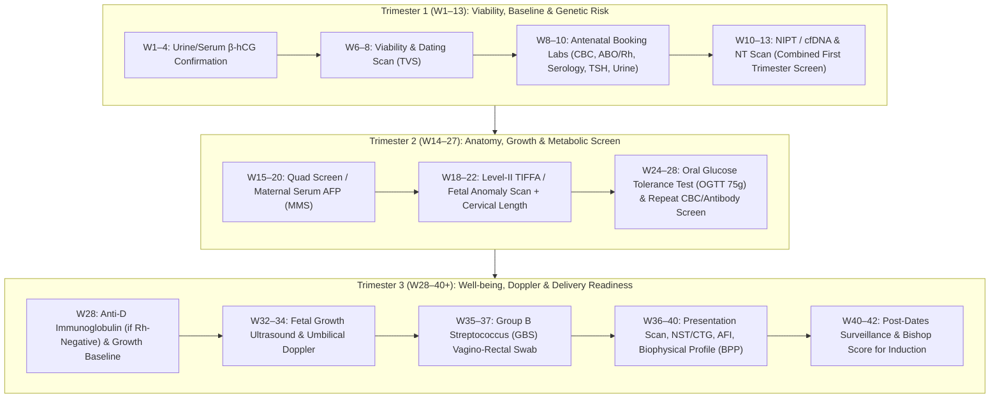
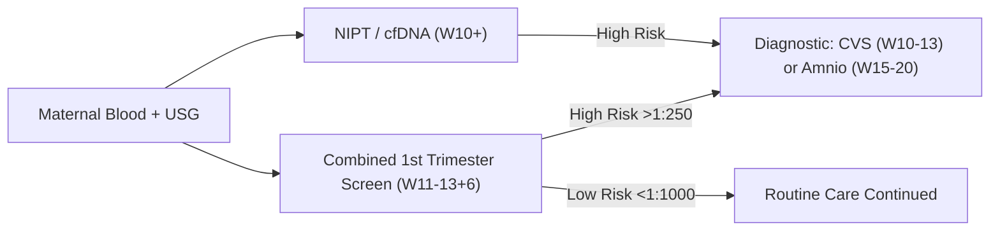
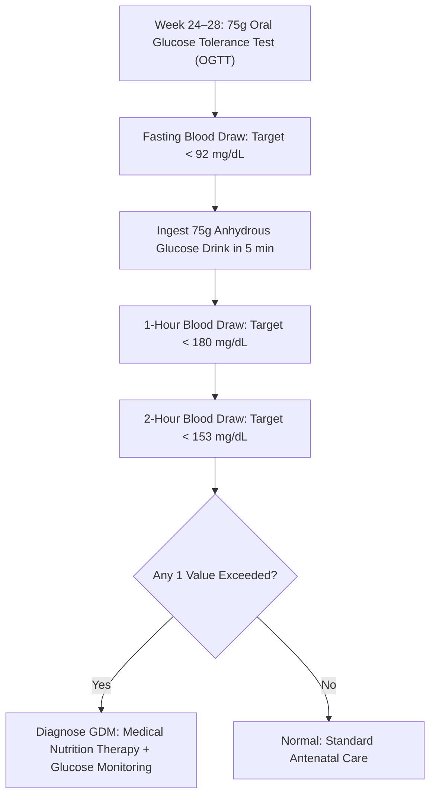
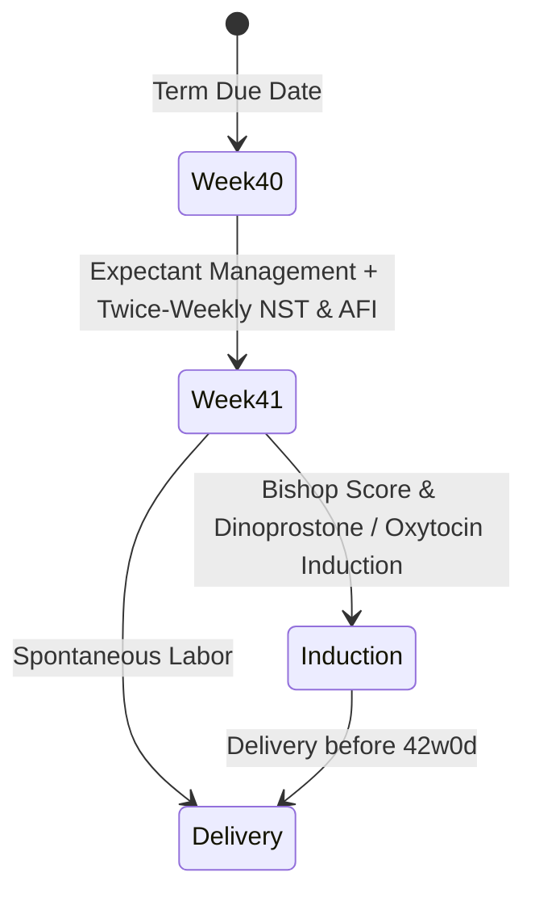

# 🤰 Complete Week-by-Week Prenatal Diagnostic Testing & Monitoring Protocol
### *Evidence-Based Clinical Guide (ACOG, WHO, NHS NICE & MoHFW Guidelines)*

---

## 📑 Table of Contents
1. [Overview & Antenatal Testing Roadmap](#1-overview--antenatal-testing-roadmap)
2. [Master Week-by-Week Antenatal Schedule (Weeks 1 – 42+)](#2-master-week-by-week-antenatal-schedule)
3. [First Trimester: Conception to Week 13](#3-first-trimester-weeks-1--13)
4. [Second Trimester: Weeks 14 to 27](#4-second-trimester-weeks-14--27)
5. [Third Trimester: Weeks 28 to 40+](#5-third-trimester-weeks-28--40)
6. [Post-Dates & Intrapartum Surveillance (Weeks 40 – 42+)](#6-post-dates--intrapartum-surveillance)
7. [High-Risk Maternal-Fetal Diagnostic Pathways](#7-high-risk-maternal-fetal-diagnostic-pathways)
8. [Postpartum Maternal Evaluation (Day 1 to Week 6 Post-Birth)](#8-postpartum-maternal-evaluation)
9. [Reference Ranges & Critical Warning Thresholds Matrix](#9-reference-ranges--critical-warning-thresholds-matrix)

---

## 1. Overview & Antenatal Testing Roadmap

Prenatal care is structured systematically to optimize maternal and fetal outcomes, detect congenital and chromosomal abnormalities early, mitigate risks of hypertensive disorders (Preeclampsia), manage metabolic dysregulation (Gestational Diabetes Mellitus - GDM), and prepare for safe labor and delivery.



---

## 2. Master Week-by-Week Antenatal Schedule

| Week Window | Visit Type | Diagnostic Tests & Clinical Procedures | Modality | Status |
| :--- | :--- | :--- | :--- | :--- |
| **Weeks 1 – 4** | Confirmation | Home Urine Pregnancy Test (hCG), Quantitative Serum $\beta$-hCG (Serial 48-hr doubling check if ectopic suspected) | Blood / Urine | Routine |
| **Weeks 6 – 8** | First Visit | **Early Pregnancy Ultrasound / Dating & Viability Scan (TVS)**: CRL measurement, Fetal Heart Rate (FHR), Crown-Rump Length, Rule out ectopic/molar pregnancy. | Ultrasound | Routine |
| **Weeks 8 – 10** | Booking Visit | **Comprehensive Booking Bloods & Urine Profile**: CBC, ABO/Rh typing, Indirect Coombs Test, Infectious Panel (HIV, HBsAg, HCV, VDRL/Syphilis, Rubella IgG), Fasting Plasma Glucose / HbA1c, TSH, Urine Routine & Microscopic + Urine Culture. | Blood / Urine | Mandatory |
| **Weeks 10 – 13** | Genetic Screen | **Cell-Free DNA (cfDNA / NIPT)**: Screens Trisomy 21 (Down), 18 (Edwards), 13 (Patau), Microdeletions, Fetal Sex.<br>**Chorionic Villus Sampling (CVS)** (if high risk). | Blood / Invasive | Optional / Indicated |
| **Weeks 11 – 13+6** | Genetic Screen | **First Trimester Combined Screening**: Nuchal Translucency (NT) Scan + Maternal Serum PAPP-A & Free $\beta$-hCG + Uterine Artery Doppler (Preeclampsia risk). | Ultrasound + Blood | Routine |
| **Weeks 15 – 20** | Quad Screen | **Quadruple Marker Screen** (MMS-4): AFP, total hCG, Unconjugated Estriol ($uE_3$), Inhibin-A. Detects Neural Tube Defects (Spina Bifida, Anencephaly).<br>**Amniocentesis** (if genetic diagnosis required). | Blood / Invasive | Routine / Indicated |
| **Weeks 18 – 22** | Anatomy Scan | **Level-II Target Scan / TIFFA (Targeted Imaging for Fetal Anomalies)**: Full systemic organ review, Cardiac outflow tracts, Brain ventricles, Spine, Placental location, Amniotic fluid, Transvaginal Cervical Length (rule out cervical insufficiency). | Ultrasound | Mandatory |
| **Weeks 24 – 28** | Metabolic Screen | **75g 2-Hour Oral Glucose Tolerance Test (OGTT)** (IADPSG / DIPSI criteria) for Gestational Diabetes.<br>**Repeat CBC**: Screening for physiological gestational anemia.<br>**Repeat Indirect Coombs Test**: For Rh(D)-negative mothers. | Blood | Mandatory |
| **Week 28** | Prophylaxis | **Anti-D Rh Immunoglobulin (RhoGAM 300 mcg)** administered intramuscularly to all non-sensitized Rh-negative pregnant mothers. | Injection | Routine (if Rh-) |
| **Weeks 28 – 32** | Growth & Doppler | **Third Trimester Growth Ultrasound & Umbilical Artery Doppler**: Estimated Fetal Weight (EFW), Hadlock curve percentile, Head/Abdominal circumference, Amniotic Fluid Index (AFI). | Ultrasound | Routine / High Risk |
| **Weeks 32 – 34** | Maternal Vitals | Clinical evaluation: Blood pressure, Urine dipstick for protein (Preeclampsia screen), Symphysis-Fundal Height (SFH) measurement, Fetal kick counts. | Clinical / Urine | Routine |
| **Weeks 35 – 37** | Infectious Screen | **Group B Streptococcus (GBS) Screening**: Low vaginal and rectal swab culture or PCR. Determines need for intrapartum IV Ampicillin/Penicillin prophylaxis.<br>Repeat CBC, Platelet count, Coagulation profile (PT/INR, aPTT). | Swab / Blood | Mandatory |
| **Weeks 36 – 38** | Term Ultrasound | **Fetal Presentation & Placental Scan**: Confirm Cephalic vs. Breech presentation, rule out Placenta Previa / Accreta, estimate fetal size and amniotic fluid volume. | Ultrasound | Routine |
| **Weeks 38 – 40** | Well-being Assessment | **Cardiotocography (CTG) / Non-Stress Test (NST)**: 20-minute fetal heart tracing.<br>**Biophysical Profile (BPP)**: Movement, tone, breathing, AFI.<br>Cervical Pelvic Examination (Bishop Score for labor readiness). | Electronic Tracing + USG | Routine |
| **Weeks 40 – 42** | Post-Dates | Serial NST + AFI twice weekly. Color Doppler (MCA PI / Umbilical ratio). Planned labor induction at Week 41+0 to 41+6 to avoid meconium aspiration and stillbirth. | CTG + USG | High Risk Surveillance |

---

## 3. First Trimester: Weeks 1 – 13

### 3.1 Confirmation & Early Viability (Weeks 1 to 8)
- **Quantitative Serum $\beta$-hCG:**
  - *Purpose:* Confirms pregnancy; monitors viability in early spotting or suspected ectopic.
  - *Expected Dynamic:* Should double every 48 to 72 hours up to 6,000 mIU/mL.
  - *Discriminatory Zone:* $\ge 1,500 – 2,000\text{ mIU/mL}$ should show an intrauterine gestational sac on transvaginal ultrasound.
- **Dating & Viability Ultrasound (TVS) (Weeks 6–8):**
  - *Gestational Sac:* Visible from 4.5–5 weeks.
  - *Yolk Sac:* Confirms intrauterine pregnancy (visible at 5.5 weeks).
  - *Crown-Rump Length (CRL):* Gold standard metric for estimating gestational age and Estimated Date of Delivery (EDD) ($\pm 3-5$ days accuracy).
  - *Fetal Cardiac Activity:* Detectable when CRL $> 5\text{ mm}$ (Normal FHR: 110–160 beats per minute).

---

### 3.2 First Antenatal Booking Labs (Weeks 8 to 10)
A standard comprehensive panel to establish maternal baseline physiology and screen for transmissible infections:

1. **Complete Blood Count (CBC) & Hemoglobin:**
   - *Baseline Normal:* $\text{Hb} \ge 11.0\text{ g/dL}$, Hematocrit $\ge 33\%$, Platelets $150,000 – 450,000/\mu\text{L}$.
   - *Anemia Flag:* $\text{Hb} < 11.0\text{ g/dL}$ in First Trimester (requires iron profile / ferritin evaluation).
2. **Blood Grouping (ABO) & Rh(D) Factor:**
   - *Purpose:* Identifies risk for Rhesus isoimmunization (Rh-negative mother carrying Rh-positive fetus).
3. **Indirect Coombs Test (ICT / Antibody Screen):**
   - *Purpose:* Detects maternal anti-D, Kell, Duffy, or Lewis antibodies. If positive, maternal antibody titers are monitored serially.
4. **Infectious Disease Serology (TORCH & Viral Panel):**
   - **HIV 1 & 2 ELISA / CLIA:** Voluntary opt-out universal screening.
   - **Hepatitis B Surface Antigen (HBsAg):** Identifies carrier mothers needing neonatal immunoprophylaxis (HBIg + Vaccine within 12h of birth).
   - **Hepatitis C Antibody (Anti-HCV):** Screen for active viremia.
   - **Syphilis (VDRL / RPR / TPHA):** Prevents congenital syphilis; treated immediately with Benzathine Penicillin G.
   - **Rubella IgG Titer:** Confirms immunity ($> 10\text{ IU/mL}$). If non-immune, MMR vaccination is deferred until postpartum.
   - **Varicella Zoster IgG:** For mothers without clear chickenpox history.
5. **Thyroid Stimulating Hormone (TSH) & Free T4:**
   - *Trimester 1 Target:* TSH $< 2.5\text{ mIU/L}$ (Prevents neurodevelopmental impairment and miscarriage).
6. **Metabolic Baseline:**
   - Fasting Blood Sugar (FBS) target: $< 92\text{ mg/dL}$ or $\text{HbA1c} < 5.7\%$ to rule out pre-existing Overt Diabetes.
7. **Urine Routine, Microscopy & Urine Culture:**
   - *Screening for Asymptomatic Bacteriuria (ASB):* Defined as $\ge 10^5\text{ CFU/mL}$ of a single pathogen. Must be treated with safe antibiotics (Nitrofurantoin / Cefalexin / Amoxicillin-Clavulanate) to prevent pyelonephritis and preterm labor.
   - Proteinuria dipstick baseline (trace / negative).
8. **Hemoglobinopathy Screen (HPLC / Hb Electrophoresis):**
   - Mandatory in high-prevalence areas to identify Thalassemia minor/trait or Sickle Cell trait ($HbA_2 > 3.5\%$).

---

### 3.3 Aneuploidy & Genetic Screening (Weeks 10 to 13+6)



1. **Non-Invasive Prenatal Testing (NIPT / cfDNA):**
   - *Timing:* Week 10+ onwards (requires $\ge 4\%$ fetal fraction).
   - *Detection Rate:* $> 99\%$ for Trisomy 21 (Down Syndrome), $> 97\%$ for Trisomy 18 (Edwards), $> 92\%$ for Trisomy 13 (Patau).
   - *Scope:* Autosomal trisomies, Sex chromosome aneuploidies (Turner $45,X$, Klinefelter $47,XXY$), Microdeletion syndromes (22q11.2 DiGeorge).
2. **First Trimester Combined Screening (FTS / OSCAR):**
   - **Nuchal Translucency (NT) Scan (11w0d – 13w6d, CRL 45–84 mm):**
     - Measures subcutaneous fluid behind fetal neck.
     - *Normal:* $< 2.5 – 3.0\text{ mm}$ (or $< 95\text{th percentile}$).
     - *Increased NT:* Associated with aneuploidies, congenital heart defects, Noonan syndrome.
     - *Nasal Bone Presence:* Absent nasal bone increases likelihood ratio for Trisomy 21.
   - **Serum Biochemical Markers:**
     - **PAPP-A (Pregnancy-Associated Plasma Protein-A):** Decreased ($< 0.4\text{ MoM}$) in Trisomy 21 and associated with placental insufficiency.
     - **Free $\beta$-hCG:** Elevated ($> 2.0\text{ MoM}$) in Trisomy 21; low in Trisomy 18/13.
3. **Uterine Artery Doppler (Preeclampsia Risk Stratification):**
   - Mean Uterine Artery Pulsatility Index (UtA-PI) + Mean Arterial Pressure (MAP) + Serum PlGF (Placental Growth Factor).
   - Identifies mothers who benefit from prophylactic **Low-Dose Aspirin (150 mg/day)** initiated before 16 weeks.
4. **Diagnostic Confirmation Procedures (if screening positive):**
   - **Chorionic Villus Sampling (CVS):** Performed between 10w0d and 13w6d via transabdominal or transcervical placental biopsy. Provides fetal karyotype and chromosomal microarray (CMA). Procedure-related loss rate: $\sim 0.2\%$.

---

## 4. Second Trimester: Weeks 14 – 27

### 4.1 Second Trimester Serum Screening (Weeks 15 to 20)
*Indicated if First Trimester screening was missed:*
- **Quadruple Marker Screen (Quad Screen / MMS-4):**
  1. **Maternal Serum Alpha-Fetoprotein (MSAFP):** Elevated ($> 2.5\text{ MoM}$) indicates Open Neural Tube Defects (Spina Bifida, Anencephaly), abdominal wall defects (Omphalocele, Gastroschisis), or multiple gestation. Low in Down Syndrome.
  2. **Total hCG:** Elevated in Down Syndrome ($> 2.0\text{ MoM}$).
  3. **Unconjugated Estriol ($uE_3$):** Low in Down Syndrome and Edwards Syndrome.
  4. **Dimeric Inhibin-A (DIA):** Elevated in Down Syndrome.
- **Diagnostic Amniocentesis (Weeks 15 to 22):** Transabdominal aspiration of amniotic fluid for definitive cytogenetic analysis (karyotype, QF-PCR, Microarray).

---

### 4.2 Comprehensive Level-II / TIFFA Anatomy Ultrasound (Weeks 18 to 22)
The most critical structural assessment of pregnancy:

| Organ System | Specific Structures Evaluated | Key Abnormalities Screened |
| :--- | :--- | :--- |
| **Central Nervous System** | Biparietal diameter (BPD), Head Circumference (HC), Lateral ventricles ($< 10\text{ mm}$), Cisterna magna ($2-10\text{ mm}$), Cerebellar diameter, Cavum Septi Pellucidi (CSP), Intact cranium | Hydrocephalus, Ventriculomegaly, Dandy-Walker malformation, Arnold-Chiari II ("Lemon" & "Banana" sign for Spina Bifida), Agenesis of corpus callosum. |
| **Fetal Face & Neck** | Orbits, Interocular distance, Nasal bone, Upper lip & palate profile, Nuchal fold thickness ($< 6\text{ mm}$) | Cleft lip/palate, Micrognathia, Hypotelorism, Thickened nuchal fold. |
| **Cardiovascular System** | 4-Chamber view, Left & Right Ventricular Outflow Tracts (LVOT/RVOT), 3-Vessel and Trachea view (3VT), Cardiac axis ($45^\circ \pm 20^\circ$), Rhythm | VSD, Fallot's Tetralogy, Transposition of Great Arteries (TGA), Coarctation of Aorta, Hypoplastic Left Heart Syndrome. |
| **Thorax & Lungs** | Lung echogenicity, Diaphragm continuity | Congenital Diaphragmatic Hernia (CDH), CPAM/CCAM, Pleural effusion. |
| **Gastrointestinal & Abdominal Wall** | Stomach bubble (Left upper quadrant), Bowel echogenicity, Cord insertion site, Abdominal circumference (AC) | Omphalocele, Gastroschisis, Duodenal atresia ("Double bubble"), Echogenic bowel (CF, CMV, Trisomy). |
| **Renal & Urinary** | Both kidneys present in renal fossae, Renal pelvis AP diameter ($< 4\text{ mm}$ in T2), Urinary bladder filling | Hydronephrosis, Multicystic dysplastic kidney, Renal agenesis, Posterior urethral valves. |
| **Musculoskeletal & Spine** | Intact vertebrae throughout spine, Longitudinal long bones (Femur Length - FL, Humerus), Digits of hands and feet | Skeletal dysplasias, Club foot (Talipes equinovarus), Polydactyly, Spina bifida aperta/occulta. |
| **Placenta & Cervix** | Placental location (Upper vs. Low lying / Placenta Previa), Cord vessels (3-vessel cord: 2 arteries, 1 vein), **Transvaginal Cervical Length (CL)** | Placenta previa, Single Umbilical Artery (SUA), Short cervix ($< 25\text{ mm}$ indicating preterm birth risk requiring Progesterone or Cerclage). |

---

### 4.3 Gestational Diabetes & Anemia Screening (Weeks 24 to 28)



1. **75g 2-Hour Oral Glucose Tolerance Test (OGTT - WHO/IADPSG Standard):**
   - *Preparation:* 3 days of unrestricted carbohydrate diet; 8–12 hours overnight fast.
   - *Diagnostic Cutoffs (1 or more values diagnostic for GDM):*
     - **Fasting:** $\ge 92\text{ mg/dL}$ ($5.1\text{ mmol/L}$)
     - **1-Hour:** $\ge 180\text{ mg/dL}$ ($10.0\text{ mmol/L}$)
     - **2-Hour:** $\ge 153\text{ mg/dL}$ ($8.5\text{ mmol/L}$)
2. **Alternative Two-Step Protocol (ACOG / Carpenter-Coustan):**
   - Step 1: 50g non-fasting Glucose Challenge Test (GCT). If 1-hr glucose $\ge 130 – 140\text{ mg/dL}$, proceed to Step 2.
   - Step 2: 100g 3-Hour Fasting OGTT (Fasting $\ge 95$, 1h $\ge 180$, 2h $\ge 155$, 3h $\ge 140\text{ mg/dL}$; 2 or more values diagnostic).
3. **Second Trimester Hematology & Blood Screen:**
   - **Repeat CBC:** Hemoglobin target $\ge 10.5\text{ g/dL}$ (physiological hemodilution nadir occurs at 26–28 weeks).
   - **Repeat Indirect Coombs Test (ICT):** Required for all Rh-negative non-sensitized mothers.
   - **Anti-D Prophylaxis Administration:** If antibody screen is negative, administer **Anti-D Rh Immunoglobulin 300 mcg (1500 IU)** at 28 weeks.

---

## 5. Third Trimester: Weeks 28 – 40

### 5.1 Fetal Growth, Well-Being & Doppler Ultrasound (Weeks 28 to 34)
- **Growth Ultrasound Biometry:**
  - Measures BPD, HC, AC, and FL to compute **Estimated Fetal Weight (EFW)** via Hadlock formula.
  - *SGA (Small for Gestational Age):* EFW $< 10\text{th percentile}$.
  - *FGR / IUGR (Fetal Growth Restriction):* EFW $< 3\text{rd percentile}$ or abdominal circumference trajectory dropping $> 2$ quartiles with abnormal Doppler.
  - *LGA / Macrosomia:* EFW $> 90\text{th percentile}$ or $> 4000\text{ g}$ at term.
- **Amniotic Fluid Quantification:**
  - **Amniotic Fluid Index (AFI):** Sum of deepest vertical pockets in 4 quadrants. Normal: $8.0 – 24.0\text{ cm}$.
    - *Oligohydramnios:* $\text{AFI} < 5.0\text{ cm}$ or Single Deepest Pocket (SDP) $< 2.0\text{ cm}$.
    - *Polyhydramnios:* $\text{AFI} > 24.0\text{ cm}$ or $\text{SDP} > 8.0\text{ cm}$.
- **Fetal & Uteroplacental Doppler Studies:**
  - **Umbilical Artery (UA) Doppler:** Evaluates placental vascular resistance. Normal diastolic flow $\rightarrow$ Decreased diastolic flow $\rightarrow$ Absent End-Diastolic Velocity (AEDV) $\rightarrow$ Reversed End-Diastolic Velocity (REDV - critical emergency).
  - **Middle Cerebral Artery (MCA) Doppler:** Peak Systolic Velocity (PSV) screens for fetal anemia ($> 1.5\text{ MoM}$). MCA Pulsatility Index (PI) shows brain sparing in chronic hypoxia.
  - **Ductus Venosus (DV) Doppler:** Evaluates right heart preload. Absent or reversed 'a-wave' signifies impending fetal acidemia.

---

### 5.2 Group B Streptococcus (GBS) Screening (Weeks 35 to 37)
- **Sample Collection:** Swab of the lower vagina (introital) and anorectum without a speculum.
- **Microbiology:** Enriched selective broth culture or rapid real-time PCR.
- **Clinical Action:**
  - If **Positive**: Intrapartum IV antibiotic prophylaxis (**Ampicillin 2g IV loading, then 1g q4h** or **Penicillin G 5 million units loading, then 2.5-3.0 million units q4h**) initiated at onset of labor or rupture of membranes.
  - Prevents early-onset neonatal GBS sepsis, pneumonia, and meningitis.
  - *Exceptions:* GBS bacteriuria at any time during current pregnancy or prior child with GBS invasive disease automatically mandates intrapartum prophylaxis without re-swabbing.

---

### 5.3 Late Third Trimester & Pre-Labor Evaluations (Weeks 36 to 40)
1. **Fetal Presentation Scan:**
   - Evaluates fetal lie (Longitudinal/Transverse) and presenting part (Cephalic/Vertex vs. Breech vs. Shoulder).
   - If Breech at 36–37 weeks: Evaluation for External Cephalic Version (ECV) or planned Cesarean Delivery.
2. **Cardiotocography (CTG) / Non-Stress Test (NST):**
   - Continuous electronic fetal heart rate recording for 20–40 minutes.
   - **Reactive (Reassuring) NST Criteria:**
     - Baseline FHR: 110 – 160 bpm.
     - Moderate Baseline Variability: 6 – 25 bpm amplitude.
     - Accelerations: $\ge 2$ accelerations peaking $\ge 15\text{ bpm}$ above baseline and lasting $\ge 15\text{ seconds}$ within a 20-minute window ($15\times 15$ rule; or $10\times 10$ prior to 32 weeks).
     - Decelerations: Absence of late or recurrent variable decelerations.
3. **Manning's Biophysical Profile (BPP - Score out of 10):**
   - Evaluates 5 ultrasound and CTG parameters (2 points each if normal, 0 points if abnormal):
     1. *Reactive NST* ($\ge 2$ accelerations in 20 min).
     2. *Fetal Breathing Movements* ($\ge 1$ episode of sustained rhythmic breathing lasting $\ge 30\text{ sec}$ in 30 min).
     3. *Fetal Gross Body Movements* ($\ge 3$ discrete body or limb movements in 30 min).
     4. *Fetal Tone* ($\ge 1$ episode of active extension with return to flexion of limbs or opening/closing of hand).
     5. *Amniotic Fluid Volume* (At least 1 vertical pocket $\ge 2.0\text{ cm} \times 1.0\text{ cm}$).
   - *Interpretation:* 8/10 or 10/10 = Normal; 6/10 = Equivocal (repeat in 12–24h); $\le 4/10$ = Abnormal / Chronic Asphyxia (Indication for prompt delivery).
4. **Modified BPP:** Reactive NST + Single Deepest Pocket of Amniotic Fluid (SDP $\ge 2\text{ cm}$).
5. **Cervical Bishop Score Assessment:**
   - Parameters: Cervical Dilation, Effacement, Station, Consistency, Position. Score $\ge 8$ indicates favorable cervix with high likelihood of successful vaginal delivery.

---

## 6. Post-Dates & Intrapartum Surveillance



- **Post-Term Pregnancy Definition:** Gestation $\ge 42\text{ weeks}$ ($\ge 294\text{ days}$).
- **Surveillance Protocol (Between 40w0d and 41w6d):**
  - Twice-weekly electronic FHR monitoring (NST).
  - Twice-weekly Amniotic Fluid volume assessment (AFI / SDP) to rule out post-maturity oligohydramnios.
  - Daily maternal fetal movement count ("Kick counts": minimum 10 distinct movements within a 2-hour relaxed window).
- **Induction of Labor Policy:** Most international guidelines (ACOG, NICE, WHO) recommend elective induction between **41w0d and 41w6d** to significantly reduce perinatal mortality and meconium aspiration syndrome.

---

## 7. High-Risk Maternal-Fetal Diagnostic Pathways

### 7.1 Hypertensive Disorders & Preeclampsia Protocol
- **Screening Biomarkers:** Soluble fms-like tyrosine kinase-1 (sFlt-1) to Placental Growth Factor (PlGF) ratio.
  - $\text{sFlt-1/PlGF ratio} \le 38$: Rules out preeclampsia for 1–4 weeks.
  - $\text{sFlt-1/PlGF ratio} > 85$ (early onset) or $> 110$ (late onset): Highly predictive of preeclampsia requiring delivery planning.
- **Diagnostic Laboratory Workup for Suspected Preeclampsia:**
  - BP $\ge 140/90\text{ mmHg}$ on 2 occasions 4 hours apart after 20 weeks.
  - Urine Protein-to-Creatinine Ratio (UPCR): $\ge 0.3\text{ mg/mg}$ or 24-hour urine protein $\ge 300\text{ mg}$.
  - Liver Function Tests: Serum Transaminases (AST/ALT $> 2\times$ upper limit of normal).
  - Renal Function: Serum Creatinine $> 1.1\text{ mg/dL}$ or doubling.
  - Platelet Count: Thrombocytopenia ($< 100,000/\mu\text{L}$).
  - LDH: Elevated ($> 600\text{ IU/L}$) in HELLP Syndrome (Hemolysis, Elevated Liver enzymes, Low Platelets).

### 7.2 Intrahepatic Cholestasis of Pregnancy (ICP / Obstetric Cholestasis)
- **Presentation:** Intense pruritus of palms and soles, worse at night, usually in Trimester 3.
- **Diagnostics:**
  - **Fasting Total Serum Bile Acids (TBA):**
    - Mild: $10 – 39.9\ \mu\text{mol/L}$.
    - Moderate: $40 – 99.9\ \mu\text{mol/L}$.
    - Severe: $\ge 100\ \mu\text{mol/L}$ (High risk of sudden intrauterine fetal demise; mandates delivery at 35–36 weeks).
  - Serum Transaminases (AST, ALT, GGT) & Total Bilirubin.

---

## 8. Postpartum Maternal Evaluation

| Timeframe | Clinical Tests & Assessments | Target Objective |
| :--- | :--- | :--- |
| **Day 1 – 2 (Inpatient / Immediate)** | CBC / Hemoglobin check (post-delivery blood loss evaluation), Rh immune globulin (if infant is Rh+ and mother Rh- with negative Kleihauer-Betke or rosette test), Blood Pressure monitoring, Voiding assessment. | Detect postpartum hemorrhage (PPH), prevent Rh isoimmunization, monitor preeclampsia eclampsia relapse. |
| **Week 1 – 2** | Postpartum BP check (especially in preeclampsia / gestational hypertension), Wound inspection (Cesarean Pfannenstiel scar or perineal tear healing), Lochia evaluation, Mood assessment (Edinburgh Postnatal Depression Scale - EPDS). | Early detection of delayed postpartum preeclampsia, wound infection, endometritis. |
| **Week 6 (Postnatal Final Visit)** | **75g 2-Hour OGTT** for all mothers diagnosed with GDM (screens for persistent Type 2 Diabetes), Thyroid panel (TSH for postpartum thyroiditis if symptomatic), Pelvic exam, Contraception counseling, EPDS mental health screen. | Long-term cardiometabolic risk stratification & reproductive health. |

---

## 9. Reference Ranges & Critical Warning Thresholds Matrix

```
====================================================================================================
PARAMETER                       NORMAL PREGNANCY RANGE                  CRITICAL WARNING THRESHOLD
====================================================================================================
Hemoglobin (Hb) - T1 & T3       11.0 – 14.0 g/dL                        < 10.0 g/dL (Severe: < 7.0 g/dL)
Hemoglobin (Hb) - T2            10.5 – 14.0 g/dL                        < 10.0 g/dL
Platelet Count                  150,000 – 400,000 /μL                   < 100,000 /μL (HELLP / ITP)
Blood Pressure (Systolic)       90 – 120 mmHg                           ≥ 140 mmHg (Severe: ≥ 160 mmHg)
Blood Pressure (Diastolic)      60 – 80 mmHg                            ≥ 90 mmHg (Severe: ≥ 110 mmHg)
Fasting Glucose (OGTT)          < 92 mg/dL (5.1 mmol/L)                 ≥ 92 mg/dL (GDM Diagnosis)
1-Hour OGTT Glucose             < 180 mg/dL (10.0 mmol/L)               ≥ 180 mg/dL
2-Hour OGTT Glucose             < 153 mg/dL (8.5 mmol/L)                ≥ 153 mg/dL
TSH (Trimester 1)               0.1 – 2.5 mIU/L                         > 2.5 mIU/L (Hypothyroidism)
TSH (Trimesters 2 & 3)          0.2 – 3.0 mIU/L                         > 3.0 mIU/L
Nuchal Translucency (NT)        < 2.5 mm (at CRL 45-84 mm)              ≥ 3.0 mm (Trisomy/Cardiac defect)
Cervical Length (at W18-22)     30 – 45 mm                              < 25 mm (Cervical insufficiency)
Amniotic Fluid Index (AFI)      8.0 – 24.0 cm                           < 5.0 cm (Oligo) or > 24 cm (Poly)
Single Deepest Pocket (SDP)     2.0 – 8.0 cm                            < 2.0 cm or > 8.0 cm
Fetal Heart Rate (Baseline)     110 – 160 bpm                           < 110 bpm (Brady) / > 160 (Tachy)
Total Serum Bile Acids (TBA)    < 10 μmol/L                             ≥ 40 μmol/L (Severe: ≥ 100 μmol/L)
Urine Protein / Creatinine      < 0.15 mg/mg                            ≥ 0.3 mg/mg (Preeclampsia)
====================================================================================================
```

---
*Document compiled for the **MaternaCare Intelligent Antenatal Platform**. Sourced from clinical guidelines: American College of Obstetricians and Gynecologists (ACOG Practice Bulletins), National Institute for Health and Care Excellence (NICE NG201), World Health Organization (WHO ANC Guidelines), and Ministry of Health and Family Welfare (MoHFW).*
